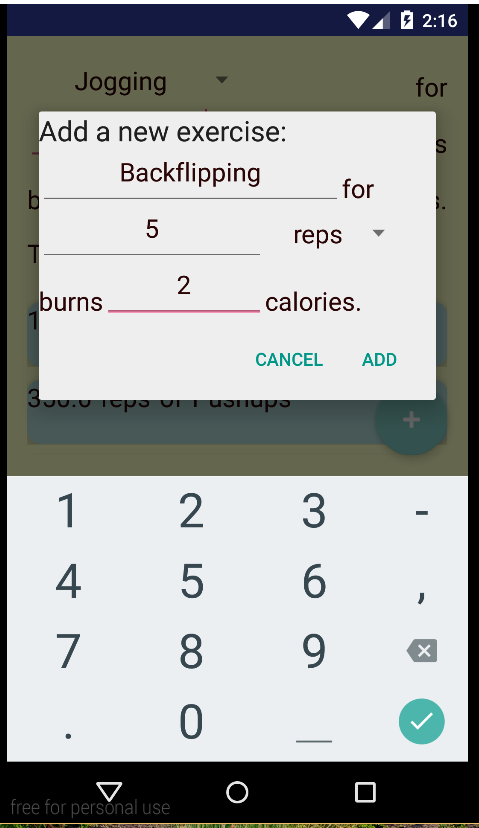
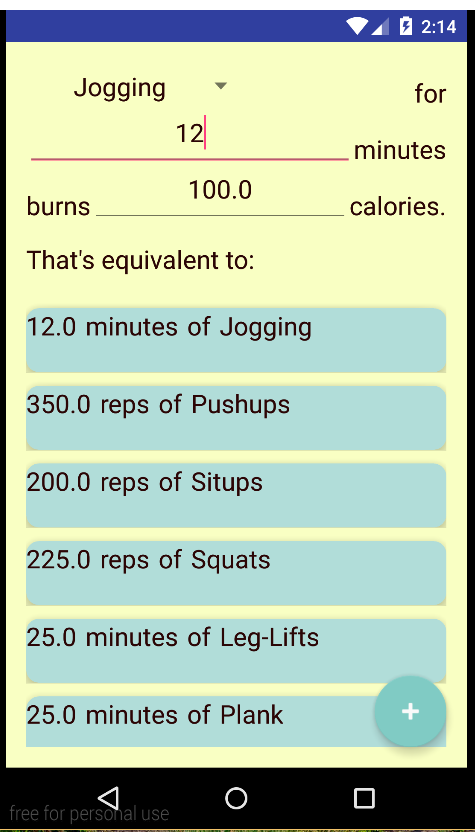
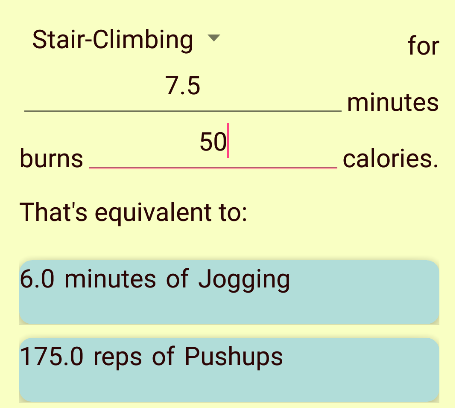
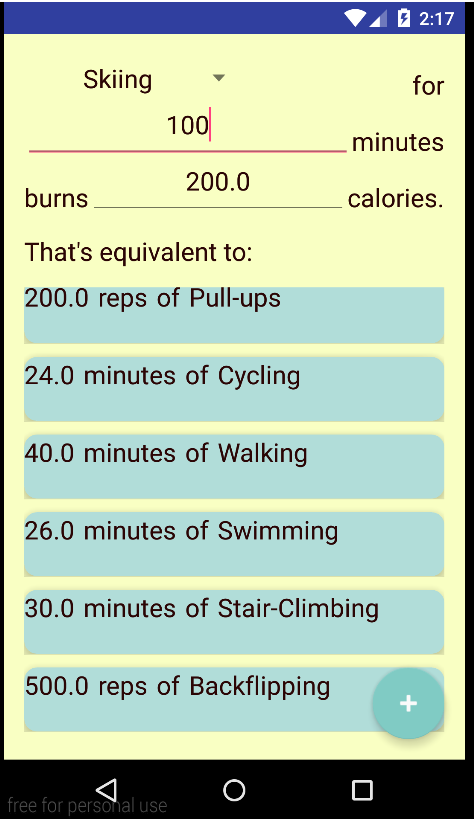
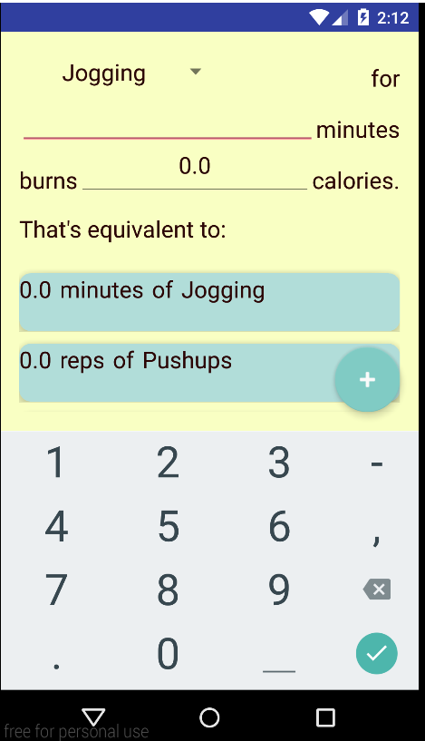
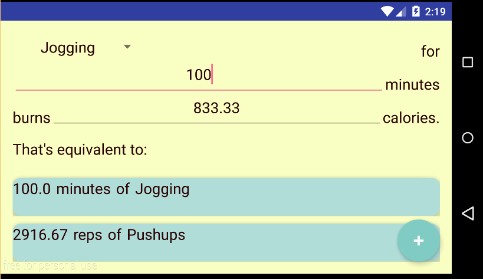
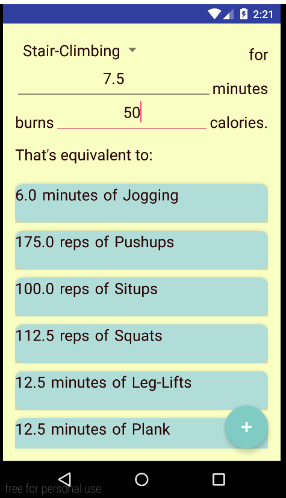

# PROG 01: Crunch Time

## Authors

Max Leefer ([maxoflions@berkeley.edu](mailto:maxoflions@berkeley.edu))

## Demo Video

See [Design01] (https://youtu.be/zuD9BtCQSEg)

## Screenshots

## Acknowledgments

Numerous tutorials, and countless StackOverflow questions to help me learn Android.
